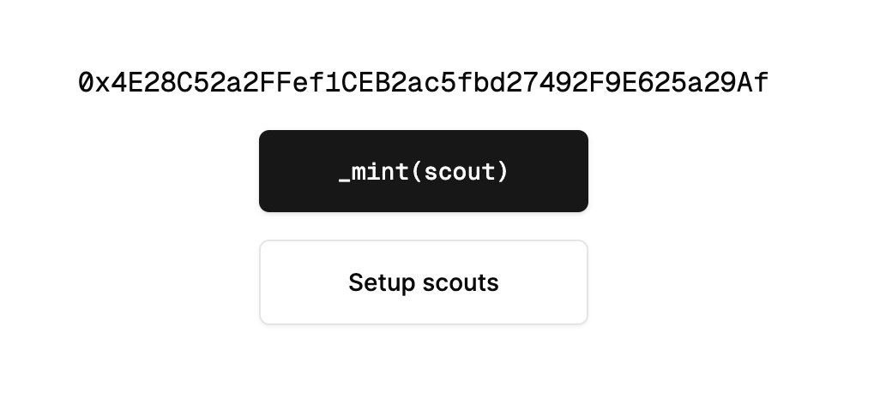

# Installation

## Website

* [Scout Portal](https://scout.chasm.net/new-scout) -> Dashboard
* [Groq](https://console.groq.com/keys) -> Save API Key
* [Mint Badge](https://scout.chasm.net/private-mint) -> get badge need MNT mainnet token

## Install Requirement Packages

### Update Package

```bash
sudo apt update -y && sudo apt upgrade -y
sudo apt install ca-certificates zlib1g-dev libncurses5-dev libgdbm-dev libnss3-dev curl git wget make jq build-essential pkg-config lsb-release libssl-dev libreadline-dev libffi-dev gcc screen unzip lz4 -y
```

### Install Docker

[docker.md](../../packages/docker.md "mention")

### Install Ngrok


[ngrok.md](../../packages/ngrok.md)


## Prerequisite

### Obtaining SCOUT\_UID and WEBHOOK\_API\_KEY

1. goto [Mint Badge](https://scout.chasm.net/private-mint)

<figure><figcaption></figcaption></figure>

2. click \__`mint(scout)`_

> at least you have 0.5 MNT in your wallet

3. Log in to the website and retrieve your webhook API key and UID as the first step.

<figure><figcaption></figcaption></figure>

### Obtaining groq API\_KEY

1. goto [Groq](https://console.groq.com/keys) and save API key

<figure><figcaption></figcaption></figure>

### Obtaining ngrok free domain

```sh
screen -R ngrok
// it will return https://xxxxxxx.ngrok-free.app
// close the screen A + D 
```

## Install Chasm

### Pull chasm docker container

```bash
docker pull chasmtech/chasm-scout:latest
```

### Create `.env` file

```bash
mkdir chasm
nano .env
// copy this configuration
PORT=3001
LOGGER_LEVEL=debug

ORCHESTRATOR_URL=https://orchestrator.chasm.net
SCOUT_NAME=ZunXBT
SCOUT_UID=PASTE UID
WEBHOOK_API_KEY=PASTE API KEY
WEBHOOK_URL=PASTE NGROK FREE APP URL LINK HERE
PROVIDERS=groq
MODEL=gemma2-9b-it
GROQ_API_KEY=PASTE GROK API KEY HERE

// close nano with ctrl + X then Y
```

### Running Docker container

```bash
docker run -d --restart=always --env-file ~/chasm/.env -p 3001:3001 --name scout chasmtech/chasm-scout
```

### Check container

```bash
docker logs scout
```

### Check LLM functionality

```bash
source ~/chasm/.env
curl -X POST \
     -H "Content-Type: application/json" \
     -H "Authorization: Bearer $WEBHOOK_API_KEY" \
     -d '{"body":"{\"model\":\"gemma2-9b-it\",\"messages\":[{\"role\":\"system\",\"content\":\"You are a helpful assistant.\"}]}"}' \
     $WEBHOOK_URL
```
